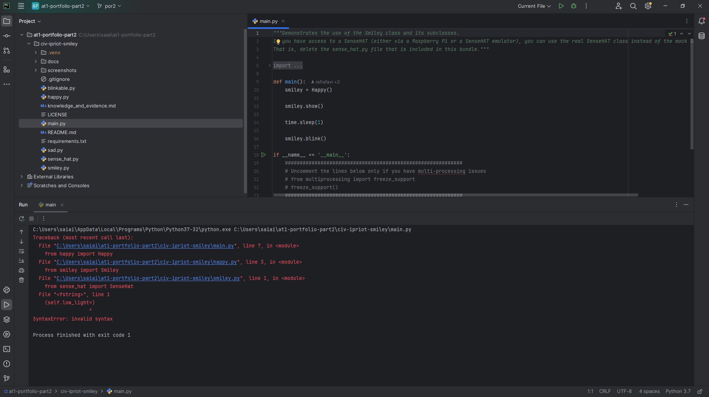
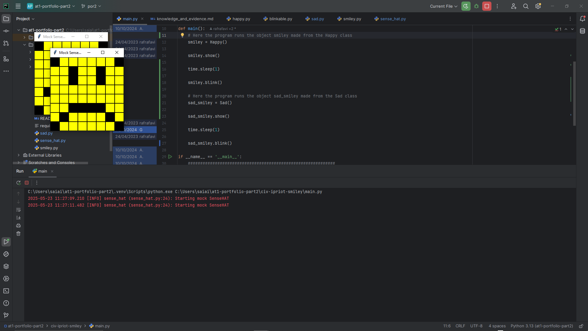
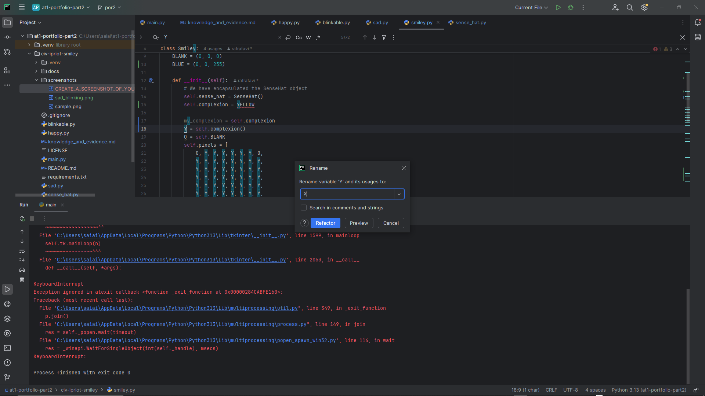

# Evidence and Knowledge

This document includes instructions and knowledge questions that must be completed to receive a *Competent* grade on this portfolio task.

## 1. Required evidence

### 1.1. Answer all questions in this document

- Each answer should be complete, well-articulated, and within the specified word count limits (if added) for each question.
- Please make sure **all** external sources are properly cited.
- You must **use your own words**. Please include your full chat transcripts if you use generative AI in any way.
- Generative AI hallucinates, is not an authoritative source

### 1.2. Make all the required modifications to the code

- Please follow the instructions in this document to make the changes needed to the code.

- When requested to upload evidence, upload all screenshots to `screenshots/` and embed them in this document. For example:

```markdown

```


> Note the `!`, and the use of a relative path.

- You must upload the code into your GitHub repository.
- While you can use a branch, your code should be in main when you submit.
- Upload a zip of this repository to Blackboard when you are ready to submit.
- You will be notified of your result via Blackboard
- However, if using GitHub classrooms, you may also receive additional feedback on GitHub directly

### 1.3. Optional: Use of Raspberry Pi and SenseHat

Raspberry Pi or SenseHat is **optional** for this activity. You can use the included `sense_hat.py` file to simulate the SenseHat on your computer.

If you use a Pi, please **delete** the `sense_hat.py` file.

### 1.4. Accessible version of the code

This project relies on visual patterns that appear on an LED matrix. If you have any accessibility requirements, you can use the `udl/accessible` branch to complete the project. This branch provides an accessible code version that uses text-based patterns instead of visual ones.

Please discuss this with your lecturer before using that branch.

## 2. Specific Tasks & Questions

Address the following tasks and questions based on the code provided in this repository.

### 2.1. Set up the project locally

1. Fork this repository (if not using GitHub Classrooms)
2. Clone your repository locally
3. Run the project locally by executing the `main.py` file
4. Evidence this by providing screenshots of the project directory structure and the output of the `main.py` file



If you are running on a Raspberry Pi, you can use the following command to run the project and then screenshot the result:

```bash
ls
python3 main.py
```

### 2.2. Fundamental code comprehension

 Answer each of the following questions **as they relate to that code** supplied by in this repository (ignore `sense_hat.py`):

1. Examine the code for the `smiley.py` file and provide  an example of a variable of each of the following types and their corresponding values (`_` should be replaced with the appropriate values):

   | Type                    | name                | value                 |
   | ----------              |---------------------|-----------------------|
   | built-in primitive type | Integer: WHITE[0]   | 255                   |
   | built-in composite type | Tuple: GREEN        | (0, 255, 0)           |
   | user-defined type       | Method: dim_display | self.sense_hat.low_light = dimmed |

2. Fill in (`_`) the following table based on the code in `smiley.py`:

   | Object                   | Type      |
   | ------------             |-----------|
   | self.pixels              | Attribute |
   | A member of self.pixels  | Integer   |
   | self                     | Smiley    |

3. Examine the code for `smiley.py`, `sad.py`, and `happy.py`. Give an example of each of the following control structures using an example from **each** of these files. Include the first line and the line range:

   | Control Flow | File      | First line | Line range            |
   | ------------ |-----------|------------|-----------------------|
   |  sequence    | sad.py    | 16         | Line 16 through to 17 |
   |  selection   | smiley.py | 13         | Line 13 through to 36 |
   |  iteration   | happy.py  | 21         | Line 21 through to 22 |

4. Though everything in Python is an object, it is sometimes said to have four "primitive" types. Examining the three files `smiley.py`, `sad.py`, and `happy.py`, identify which of the following types are used in any of these files, and give an example of each (use an example from the code, if applicable, otherwise provide an example of your own):

   | Type                    | Used?     | Example          |
   | ----------------------- |-----------|------------------|
   | int                     | smiley.py | 0                |
   | float                   | happy.py  | 0.25             |
   | str                     | N/A       | 'Smiley'         |
   | bool                    | sad.py    | wide_open = True |

5. Examining `smiley.py`, provide an example of a class variable and an instance variable (attribute). Explain **why** one is defined as a class variable and the other as an instance variable.

> A class variable would be: WHITE: (255, 255, 255)
> An instance variable would be: Y = self.YELLOW
> The class variable is similar to a global variable, as it can be used anywhere in the class, including possibly in a child made from this class. You can refer to it with the class name: Smiley.WHITE.
> An instance variable can only be used in that instance of the class, and the instance's child if made accessible to them. You can access it with: self.Y.
>

6. Examine `happy.py`, and identify the constructor (initializer) for the `Happy` class:
   1. What is the purpose of a constructor (in general) and this one (in particular)?

   > The __init__() acts like a constructor as it defines the attributes that are in the class being created like: def __init__(self, background=DEFAULT_RGB).
   > All the attributes that are passed to the class are present in this section of code, any additional attributes are made here too.
   > The self is placed in from of the attribute names, connected with a fullstop, such as; self.logger = logging.getLogger(__name__).
   > As for this __init__(), it has used a super() method to refer to all the attributes available from another class, which here is both Smiley and Blinkable.
   >

   2. What statement(s) does it execute (consider the `super` call), and what is the result?

   > The super() method can call the __init__() method from another class, the attributes from a class that's a parent or a sibling are obtained and act like this new class' attributes.
   > So it will have gotten WHITE, GREEN, etc from Smiley and self.logger, self._low_light etc from SenseHat.
   >

### 2.3. Code style

1. What code style is used in the code? Is it likely to be the same as the code style used in the SenseHat? Give to reasons as to why/why not:

> Pep8 is the code style we've been using at Tafe, so for an assignment given to us, I would assume that it would follow that same style.
> When you are importing modules from another source (ones you didn't make yourself), it can be possible that that coder has made the code in a different style.
>


2. List three aspects of this convention you see applied in the code.

> In sense_hat.py the attribute; dimming_factor in _set_pixels() method, there is the convention of starting the name with an adjective/verb followed by the noun.
> In smiley.py the import; from sense_hat import SenseHat, is at the top of the code.
> In sad.py the attribute in draw_mouth(); mouth = [49, 54, 42, 43, 44, 45], has the integers in the list all lined up starting with a square bracket,
> next to it is an integer, followed by a comma, then here goes the whitespace, an integer is next then a comma, it can then either stop with a square bracket or continue the list.
> Putting whitespace between the last comma and the integer is part of the Pep8 style, instead of maybe just; integer, comma, integer, comma (this has no whitespace).

3. Give two examples of organizational documentation in the code.

> Your answer here
> The README.md is an example of organisational documentation in the project.
> Another spot that you can find documentation is at the start of sense_hat.py, where the module docstring at the top of the page briefly explains what the program does.

### 2.4. Identifying and understanding classes

> Note: Ignore the `sense_hat.py` file when answering the questions below

1. List all the classes you identified in the project. Indicate which classes are base classes and which are subclasses. For subclasses, identify all direct base classes.
  
  Use the following table for your answers:

| Class Name | Super or Sub? | Direct parent(s)  |
|------------|---------------|-------------------|
| Happy      | Sub           | Smiley, Blinkable |
| Sad        | Sub           | Smiley            |
| Smiley     | Super         | N/A               |

2. Explain the concept of abstraction, giving an example from the project (note "implementing an ABC" is **not** in itself an example of abstraction). (Max 150 words)

> Abstraction is the simplification of a process, you might have many things that a process needs to do and be aware of, but only those that are relevant to the topic need to be present.
> If you were to make a use case for turning on the light, you have a dweller who needs the light on, all they need to know is that there is a light switch and it flips up to turn off, flips down to turn on, perhaps they need to know the light comes from the ceiling.
> If there was an electrician, then they might need to know a lot more detail about the light, like where the cables run in the wall, but we can abstract those out because it's not relevant for the dweller.
> In sad.py the method to draw the frown; draw_mouth(), is an abstraction example because it only shows the mouth changing pixels and not the eyes, because that is irrelevant to this method, which is named draw_mouth().

3. What is the name of the process of deriving from base classes? What is its purpose in this project? (Max 150 words)

> Inheritance is the name given to getting a new class from a base or parent class. The point of inheritance when used in this project is so code can be re-used.
> The tight coupling of two or more classes can occur, this is called a 'is-a' relationship.
> A triangle 'is-a' shape, where triangle is the child class and inherits the attributes and methods of the parent class.
> So in this project the purpose of using the OOP programming style of implementing classes, is to make different facial expressions on the Raspberry Pi Sense HAT interface.
> A new class having the parent class Smiley means the new class can make new expressions based on the attributes and methods that are available.
> You can make additional faces like; scared face and surprised face, you simply make new child classes that set attributes to match the new expressions. 

### 2.5. Compare and contrast classes

Compare and contrast the classes Happy and Sad.

1. What is the key difference between the two classes?
   > Happy.py is a polymorph class as it is also a Blinkable class and a Smiley class, while Sad is just derived from Smiley class.
   >
2. What are the key similarities?
   > A similarity in the Happy and Sad classes are the draw_mouth() and draw_eyes() methods exist in both classes.
   > Another similarity is that they both use the super() method to grab the attributes from the parent classes; Smiley for Sad, and Blinkable and Smiley for Happy.
   
3. What difference stands out the most to you and why?
   > The way the draw_eyes() method works is a bit different as the Sad class is not a Blinkable class, this method is written to have stagnant eyes for Sad.
   > The blink() method in happy.py is used in addition to the draw_eyes() so the draw_eyes() method is different here.
   >
4. How does this difference affect the functionality of these classes
   > This difference means that Happy can have a smiley face that blinks, but Sad doesn't produce a blinking face.
   >

### 2.6. Where is the Sense(Hat) in the code?

1. Which class(es) utilize the functionality of the SenseHat?
   > SenseHat is encapsulated in the Smiley class, so Smiley, Happy and Sad all have access to SenseHat's attributes and methods.
   >
2. Which of these classes directly interact with the SenseHat functionalities?
   > In the Smiley class where the newly made dim_display() method uses the low_light() method, the low_light() method is taken from the sense_hat.py module.
   > The Smiley class also has show() that uses set_pixels from the SenseHat class in the sense_hat.py module.
3. Discuss the hiding of the SenseHAT in terms of encapsulation (100-200 Words)
   > The attribute _low_light is private in the SenseHat class, same with the method _set_pixels(), this ensures that the child classes can't modify the details inside, like a 'read' version, rather than the ability to 'write' over them.
   > The other attributes in SenseHat are public. When used in Smiley, the details are all hidden away, as you can only view the calling of methods in dim_display(), not all the information of what it does or how low_light() works, just that it can be 'dimmed'.

### 2.7. Sad Smileys Can’t Blink (Or Can They?)

Unlike the `Happy` smiley, the current implementation of the `Sad` smiley does not possess the ability to blink. Let's first explore how blinking has been implemented in the Happy Smiley by examining the blink() method, which takes one argument that determines the duration of the blink.

**Understanding Blink Mechanism:**

1. Does the code's author believe that every `Smiley` should be able to blink? Explain.

> The code's author does not believe every facial expression should blink, otherwise they would have made the draw_eyes() method the same for Sad and Happy.
> As the code in Sad is written slightly different and also the eyes are overwritten on the last line.
> Sad should be a polymorph and inherit from Blinkable too if every class were meant to blink.

2. For those smileys that blink, does the author expect them to blink in the same way? Explain.

> As it is, The draw_eyes() method makes yellow pixels of the list of pixels [10, 13, 18 and 21], and sets the blink() method changes those eye pixels, and sets them to a black colour (void of RGB) every delay.
> The delay has been set in main.py in the main() method for 1 second, so this is the assumed blink time for all facial expressions.
> Because the method is not private it could be set differently in other expressions.
>

3. Referring to the implementation of blink in the Happy and Sad Smiley classes, give a brief explanation of what polymorphism is.

> There is no blink() in the Sad class, but if it were implemented it would need to inherit also from Blinkable.
> The Happy class is a polymorph class as it has both Smiley and Blinkable parents.
> Polymorphism is where a class can get the features of more than one class.
>

4. How is inheritance used in the blink method, and why is it important for polymorphism?

> The blink() method is only seen in the Happy class, if you wanted to make child classes using the Happy class, the blink() method could be used there.
> The parent classes for Happy are Smiley and Blinkable, so nothing new is defined in the Happy class, but there are modifications, like in blink().
> The behaviour is all taken from Smiley, except the method blink() taken from Blinkable, although it has been left blank when it was defined.
> The modifications in blink() allow the pixels to change colour to look like a blink from yellow to black.
> So although the blink() in Happy works to change the eyes to blink, another child class to Smiley and Blinkable.
> 'Surprised' might have bigger eyes, so will change the colour of extra or different pixels.
> That can be done in draw_eyes() but also in blink() where it is meant to be overwritten to do different faces.
>
1. **Implement Blink in Sad Class:**

   - Create a new method called `blink` within the Sad class. Ensure you use the same method signature as in the Happy class:

   ```python
   def blink(self, delay=0.25):
       pass  # Replace 'pass' with your implementation
   ```

2. **Code Implementation:** Implement the code that allows the Sad smiley to blink. Use the implementation from the Happy Smiley as a reference. Ensure your new method functions similarly by controlling the blink duration through the `delay` argument.

3. **Testing the Implementation:**

- Test the new blink functionality on your Raspberry Pi or within the Python classes provided. You might need to adjust the `main.py` script to incorporate Sad Smiley's new blinking capability.

Include a screenshot of the sad smiley or the modified `main.py`:



- Observe and document the Sad smiley as it blinks its eyes. Describe any adjustments or issues encountered during implementation.

  > Your answer here

  ### 2.8. If It Walks Like a Duck…

  Previously, you implemented the blink functionality for the Sad smiley without utilizing the class `Blinkable`. Assuming you did not use `Blinkable` (even if you actually did), consider how the Sad smiley could blink similarly to the Happy smiley without this specific class.

  1. **Class Type Analysis:** What kind of class is `Blinkable`? Inspect its superclass for clues about its classification.

     > Your answer here

  2. **Class Implementation:** `Blinkable` is a class intended to be implemented by other classes. What generic term describes this kind of class, which is designed for implementation by others? **Clue**: Notice the lack of any concrete implementation and the naming convention.

  > Your answer here

  3. **OO Principle Identification:** Regarding your answer to question (2), which Object-Oriented (OO) principle does this represent? Choose from the following and justify your answer in 1-2 sentences: Abstraction, Polymorphism, Inheritance, Encapsulation.

  > Your answer here

  4. **Implementation Flexibility:** Explain why you could grant the Sad Smiley a blinking feature similar to the Happy Smiley's implementation, even without directly using `Blinkable`.

  > Your answer here

  5. **Concept and Language Specificity:** In relation to your response to question (4), what is this capability known as, and why is it feasible in Python and many other dynamically typed languages but not in most statically typed programming languages like C#? **Clue** This concept is hinted at in the title of this section.

  > Your answer here

  ***

  ## 3. Refactoring

  ### 3.1. Does a Smiley Have to Be Yellow?

  While our current implementation predominantly features yellow smileys, emotional expressions like sickness or anger typically utilize colors like green, red, or orange. We'll explore the feasibility of integrating these colors into our smileys.

  1. **Defined Colors and Their Location:**

     1. Which colors are defined and in which class(s)?
        > Your answer here
     2. What type of variables hold these colors? Are the values expected to change during the program's execution? Explain your answer.
        > Your answer here
     3. Add the color blue to the appropriate class using the appropriate format and values.

  2. **Usage of Color Variables:**

     1. In which classes are the color variables used?
        > Your answer here

  3. **Simple Method to Change Colors:**
  4. What is the easiest way you can think to change the smileys to green? Easiest, not necessarily the best!
     > Your answer here

  Here's a revised version of the "Flexible Colors – Step 1" section for the smiley project, incorporating your specifications for formatting and content updates:

  ### 3.2. Flexible Colors – Step 1

  Changing the color of the smileys once is straightforward, but it isn't very flexible. To facilitate various colors for smileys, it is advisable not to hardcode values in any class. This approach was identified earlier as a necessary change. Let's start by removing the built-in assumptions about color in our classes.

  1. **Add a method called `complexion` to the `Smiley` class:** Implement this instance method to return `self.YELLOW`. Using the term "complexion" instead of "color" provides a more abstract terminology that focuses on the meaning rather than implementation.

  2. **Refactor subclasses to use the `complexion` method:** Modify any subclass that directly accesses the color variable to instead utilize the new `complexion` method. This ensures that color handling is centralized and can be easily modified in the future.

  3. **Determine the applicable Object-Oriented principle:** Consider whether Abstraction, Polymorphism, Inheritance, or Encapsulation best applies to the modifications made in this step.

  4. **Verify the implementation:** Ensure that the modifications function as expected. The smileys should still display in yellow, confirming that the new method correctly replaces the direct color references.

  This step is crucial for setting up a more flexible system for color management in the smiley display logic, allowing for easy adjustments and extensions in the future.

  ### 3.3. Flexible Colors – Step 2

  Having removed the hardcoded color values, we now enhance the base class to support dynamic color assignments more effectively.

  1. **Modify the `__init__()` method in the `Smiley` class:** Introduce a default argument named `complexion` and assign `YELLOW` as its default value. This allows the instantiation of smileys with customizable colors.

  2. **Introduce a new instance variable:** Create a variable called `my_complexion` and assign the `complexion` parameter to it. This step ensures that each smiley instance can maintain its own color state.

  3. **Rationale for `my_complexion`:** Using a distinct instance variable like `my_complexion` avoids potential conflicts with the method parameter names and clarifies that it is an attribute specific to the object.

  4. **Bulk rename:** We want to update our grid to use the value of complexion, but we have so many `Y`'s in the grid. Use your IDE's refactoring tool to rename all instances of the **symbol** `Y` to `X`. Where `X` is the value of the `complexion` variable. Include a screenshot evidencing you have found the correct refactor tool and the changes made.

  

  5. **Update the `complexion` method:** Adjust this method to return `self.my_complexion`, ensuring that whatever color is assigned during instantiation is what the smiley displays.

  6. **Verification:** Run the updated code to confirm that Smileys still defaults to yellow unless specified otherwise.

  ### 3.4. Flexible Colors – Step 3

  With the foundational changes in place, it's now possible to implement varied smiley colors for different emotional expressions.

  1. **Adjust the `Sad` class initialization:** In the `Sad` class's initializer method, change the superclass call to include the `complexion` argument with the value `self.BLUE`, as shown:

     ```python
     super().__init__(complexion=self.BLUE)
     ```

  2. **Test color functionality for the Sad smiley:** Execute the program to verify that the Sad smiley now appears blue.

  3. **Ensure the Happy smiley remains yellow:** Confirm that changes to the Sad smiley do not affect the default color of the Happy smiley, which should still display in yellow.

  4. **Design and Implement An Angry Smiley:** Create an Angry smiley class that inherits from the `Smiley` class. Set the color of the Angry smiley to red by passing `self.RED` as the `complexion` argument in the superclass call.

  ***
